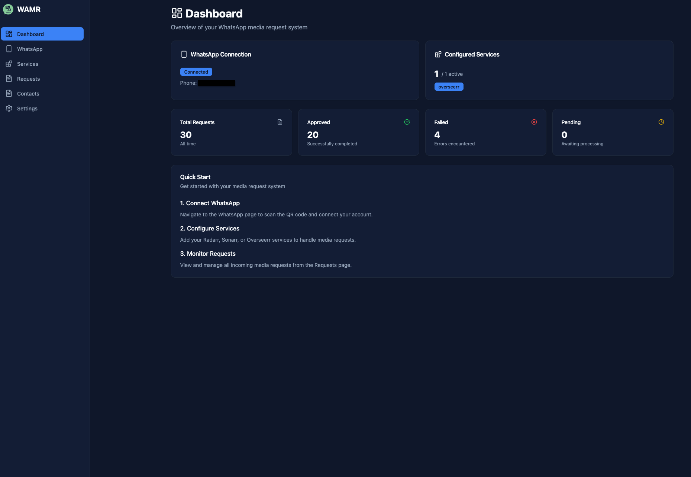
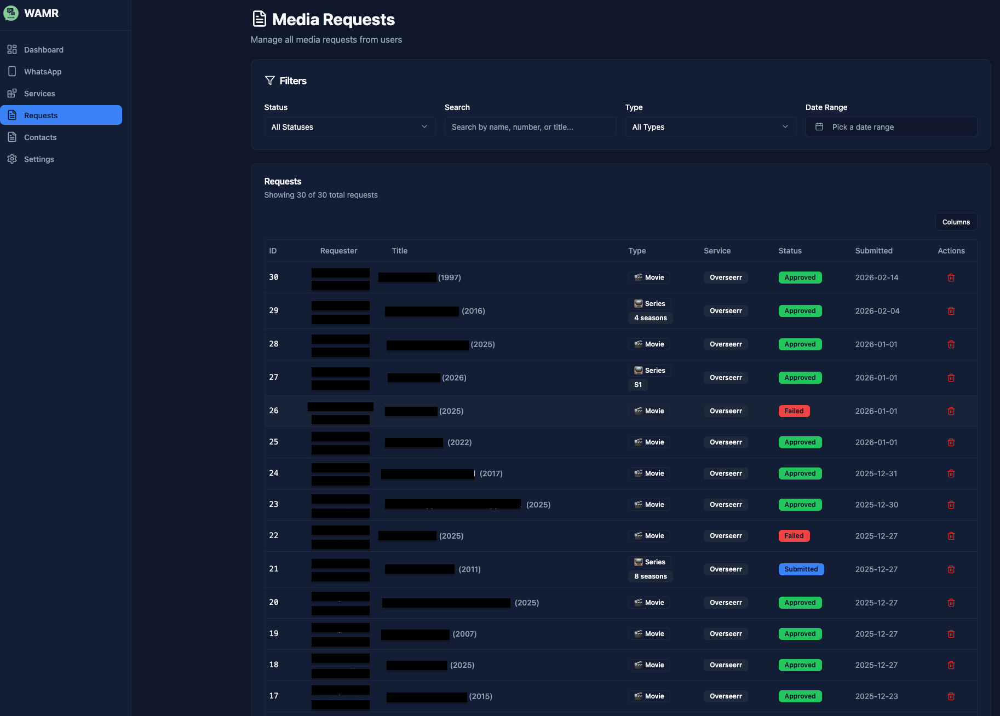
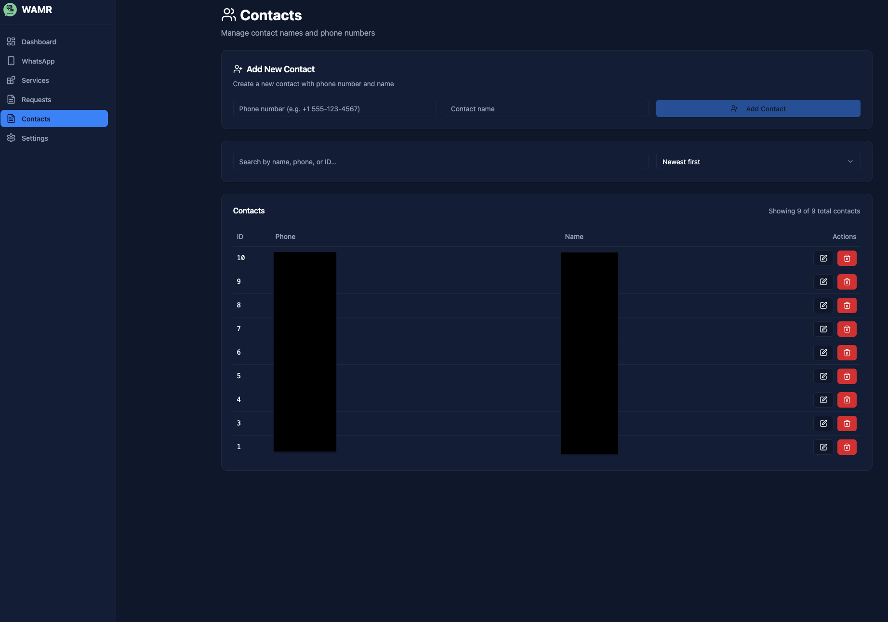
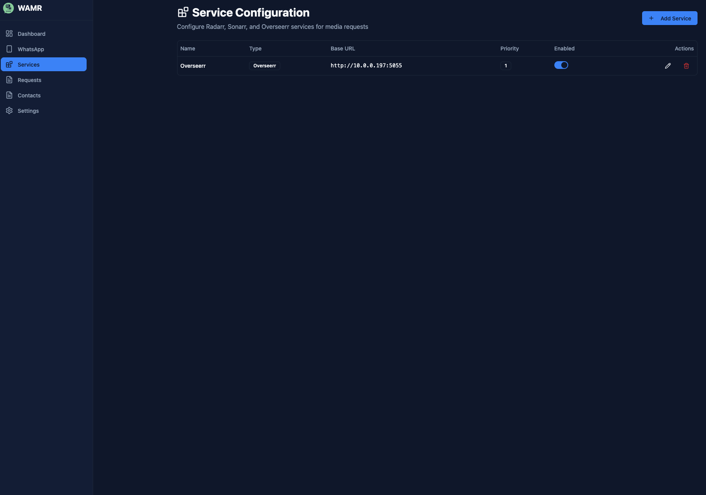
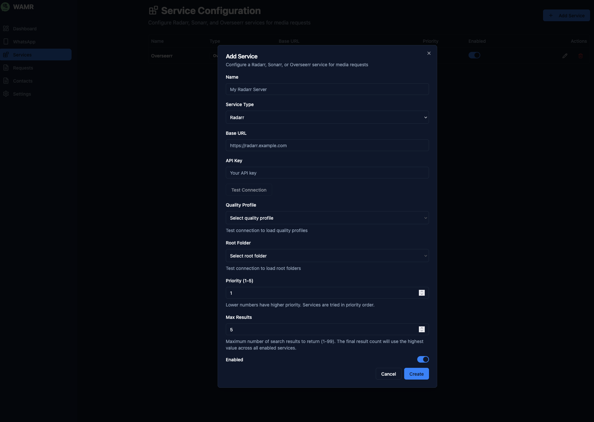
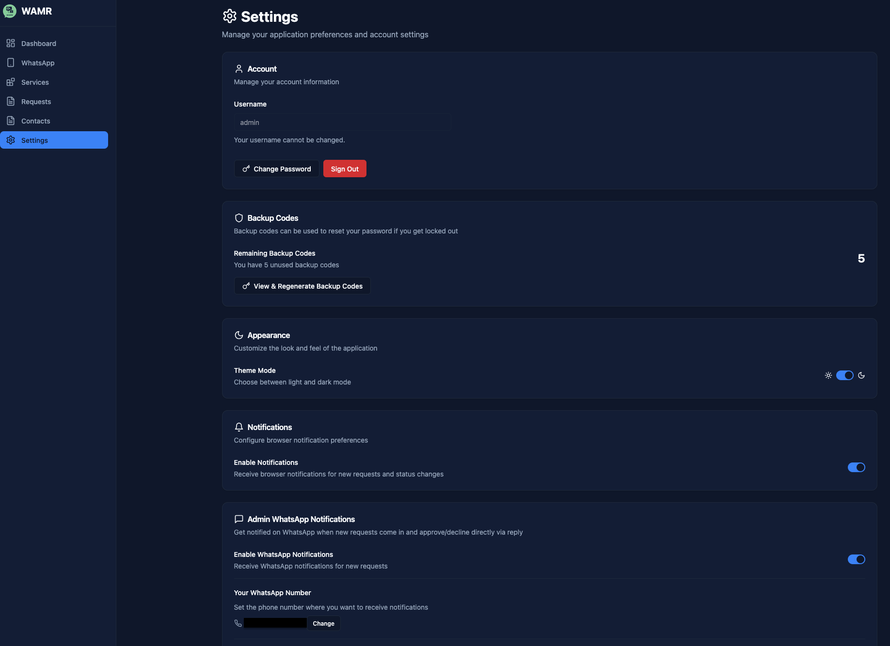
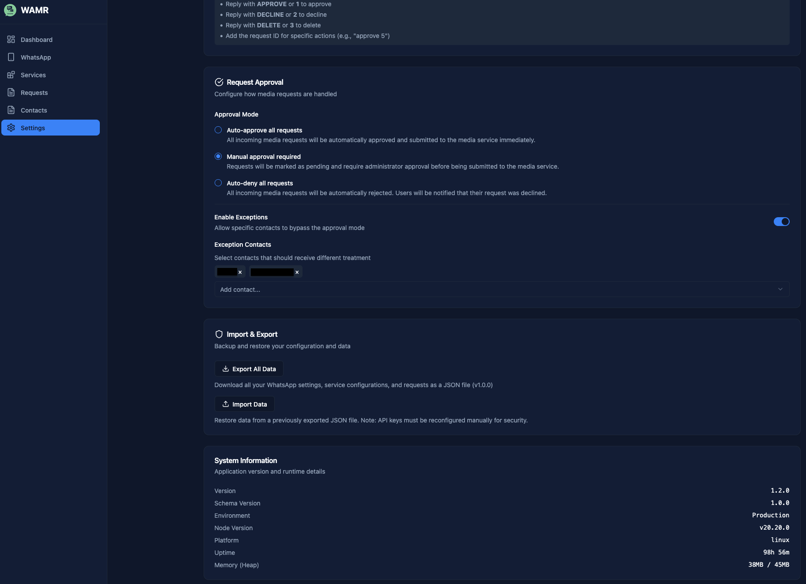

# Screenshots

A visual tour of the WAMR application interface.

---

## Dashboard

The main dashboard provides an overview of your WhatsApp media request system. It displays the WhatsApp connection status, configured services, and key statistics including total requests (30), approved requests (20), failed requests (4), and pending requests (0). The Quick Start guide helps new users get started with connecting WhatsApp, configuring services, and monitoring requests.

---

## WhatsApp Connection

The WhatsApp Connection page allows you to connect your WhatsApp account via QR code and manage the connection status. It displays the connected phone number, connection timestamp, and provides controls to restart or disconnect. The Message Filtering section lets you configure which messages should be processed by the bot (e.g., only messages starting with "$" prefix). A troubleshooting section is available for resetting the WhatsApp session if needed.

---

## Media Requests

The Media Requests page provides a comprehensive view of all incoming media requests from users. The interface includes advanced filtering options by status, type, and date range. The requests table displays ID, requester information, media title with year, type (Movie/Series), service used, current status (Approved/Failed/Submitted), submission date, and action buttons for management.

---

## Contacts

The Contacts management page allows administrators to manage contact names and phone numbers. It features an "Add New Contact" form at the top for creating new contacts, followed by a searchable and sortable table displaying all contacts with their ID, phone number, and name. Each contact can be edited or deleted using the action buttons. Contacts are added here automatically when a new request is received, allowing for easy management of requesters and their information.

---

## Service Configuration

The Service Configuration page displays all configured media services (Radarr, Sonarr, Overseerr). The table shows each service's name, type, base URL, priority level, enabled status, and action buttons for editing or deletion. An "Add Service" button is available for configuring new services.

### Add Service Modal

The Add Service modal provides a form to configure new media services. Fields include:

- Name: Custom name for the service
- Service Type: Select from Radarr, Sonarr, or Overseerr
- Base URL: The service endpoint URL
- API Key: Authentication key for the service
- Test Connection: Verify connectivity before saving
- Quality Profile: Select quality preferences
- Root Folder: Choose destination folder
- Priority: Service priority (1-5)
- Max Results: Maximum search results to return
- Enabled: Toggle to activate/deactivate the service

---

## Settings

The Settings page is organized into multiple sections for managing application preferences:

**Account**: View username and manage password. Sign out option available.

**Backup Codes**: Display remaining backup codes (5) for account recovery. Option to view and regenerate codes.

**Appearance**: Customize the look and feel with light/dark theme mode toggle.

**Notifications**: Configure browser notification preferences for new requests and status changes.

**Admin WhatsApp Notifications**: Enable notifications on WhatsApp for new requests, with the ability to approve/decline directly via reply.

**Request Approval**: Configure how media requests are handled:

- Auto-approve all requests
- Manual approval required
- Auto-deny all requests
- Enable exceptions for specific contacts

**Import & Export**: Backup and restore configuration and data:

- Export All Data: Download settings, configurations, and requests as JSON
- Import Data: Restore from a previously exported JSON file

**System Information**: Display application version (1.2.0), schema version, environment, Node version, platform, uptime, and memory usage.
